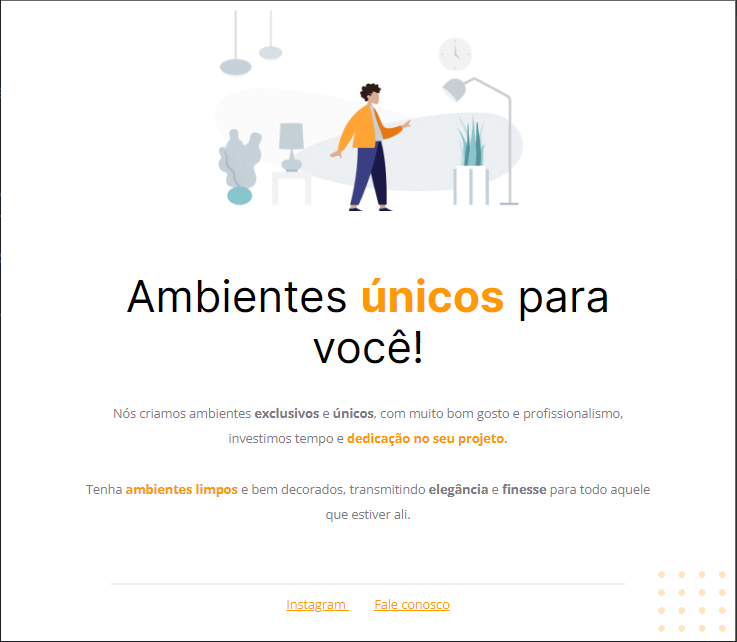

# Desafio 01 do Stage 02 _ Explorer

> Explorer

Desafio realizado no Stage 02 do curso Explorer da Rocketseat.  
Nele recebemos um código com o projeto desenvolvido durante as aulas da Fase 01.  

### O desafio:
- Corregir alguns bugs e deixar similar projeto que nos foi apresentado.

### Tecnologias utilizadas:

- HTML
- CSS

## 

  
     
  

